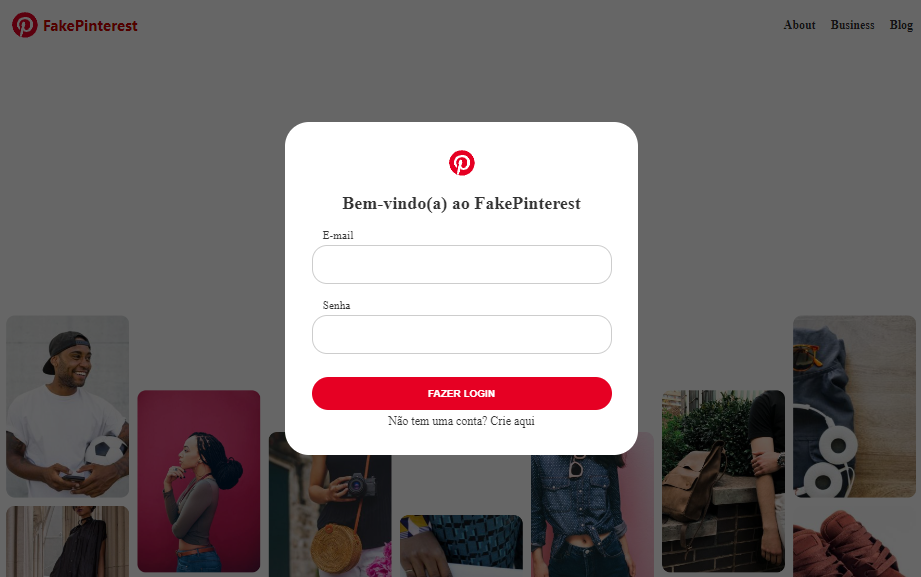
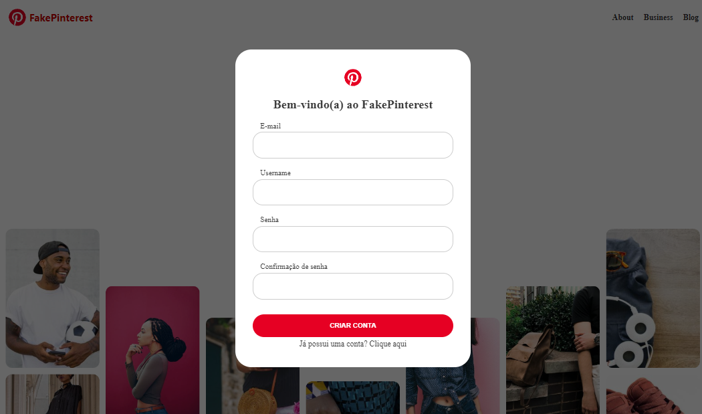
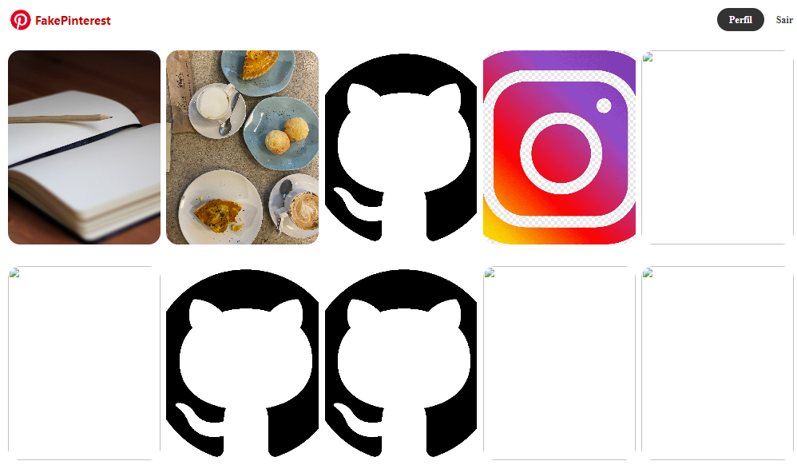

Clone do Pinterest
Este é um projeto de clone do Pinterest desenvolvido em Python, Flask, HTML e CSS. Ele permite aos usuários criar uma conta, fazer login, fazer upload de fotos e acessar um feed de fotos compartilhadas por todos os usuários.

Funcionalidades
Cadastro de Conta: Os usuários podem se cadastrar no site fornecendo um nome de usuário, endereço de e-mail e senha.

Login: Os usuários registrados podem fazer login usando seu nome de usuário e senha.

Upload de Fotos: Os usuários autenticados podem fazer upload de suas próprias fotos.

Feed de Fotos: Os usuários podem acessar um feed de fotos que mostra todas as imagens compartilhadas por todos os usuários.

Tecnologias Utilizadas
Python
Flask (Bibliotecas: flask_sqlalchemy (Banco de dados), flask_bcrypt (Criptografia de senha), flask_login (Login manager), werkzeug (segurança de arquivo), flask_wtf (formulários))
HTML 
CSS 
Banco de dados (postgreslq)

Capturas de Tela

Uso
Crie uma conta ou faça login com uma conta existente.

Faça upload de fotos.

Explore o feed de fotos compartilhadas por outros usuários.

Autor
Pedro Benvenutti

Agradecimentos
Agradeço a equipe da Hashtag Treinamentos pelas aulas e apoio.
